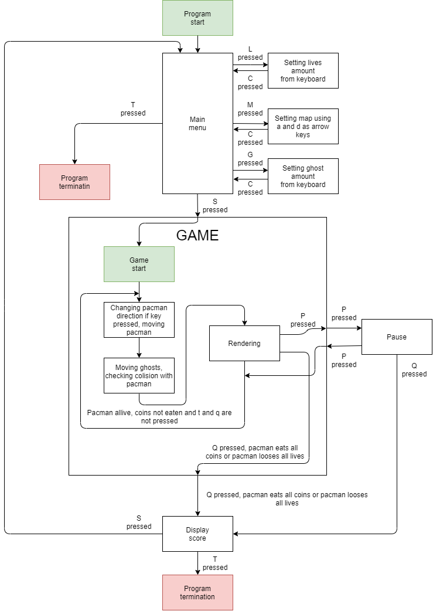

# Technická dokumnetace

## Architektura aplikace

Soubory programu jsou děleny dle funkčnosti. Podrobnjěí informace s popisem jednotlivých souborů, metod, funkcí, struktur, proměných a maker je možné dohledat v dokumentaci v sekci: [Files](files.html).

Aplikace je vytvořena pro MicroZed based MZ_APO board designed by Petr Porazil at [PiKRON](http://www.pikron.com/).

Aplikace vychází z šablony [mzapo_template](https://gitlab.fel.cvut.cz/b35apo/mzapo_template).

## Blokové schéma algoritmu

Blokové schéma popisuje fungování algoritmu hry Pac-Man.



Obecně si ho můžeme rozdělit do třech částí:

1. konfigurace dané hry (Main menu)
2. hra samotná (Game)
3. výpis skóre a pauza (Dispaly score, Pause)

## Popis kompilace a spuštění programu

Pro kompliaci programu je připravený Makefile i s předpřipraveným připojením přes *ProxyJump* do školní sítě a s možností se připojit rovnou na zařízení.

Makefile vychází z šablony [mzapo_template](https://gitlab.fel.cvut.cz/b35apo/mzapo_template).

### Nastavení Makefilu

#### Zdrojové soubory

V první části je třeba mít přidané všechny kompilované soubory.

```Makefile
SOURCES = apoman.c mzapo_phys.c mzapo_parlcd.c update_peripherals.c text_fb.c map_from_template.c map_to_fb.c draw_shapes.c
SOURCES += terminal_read.c pacman.c ghost.c
SOURCES += font_prop14x16.c font_rom8x16.c
SOURCES += map_circles.c map_conch.c map_star.c
SOURCES += menu_utilities.c
SOURCES += final_score.c
SOURCES += game.c
```

#### Cílový binární soubor

Nezapomenout název cílového binárního souboru.
```Makefile
TARGET_EXE = apoman
```

#### Propojení se pomocí *ProxyJump*

Pokud se budete chtít rovnou připojit na zařízení pomocí technologie *ProxyJump*, je vhodné rovnou do Makefilu vyplnit cílovou IP adresu zařízení
```Makefile
TARGET_IP ?= 192.168.202.203
```
 a vyplnit své uživatelské jméno s přístupem k ssh klíči.
```Makefile
SSH_OPTIONS= -i ~/.ssh/mzapo-root-key -o 'ProxyJump=username@postel.felk.cvut.cz'
```
Předejte tak zbytečnému zablokování ze strany školního serveru při opakovaném a častém připojování a přístup pro vás bude snazší.

### Důležité příkazy

#### Kompilace

```bash
make
```

#### Vymazání zkompilovaných souborů

```bash
make clean
```

#### Kompilace a zároveň spuštění přes *ProxyJump*

```bash
make run
```